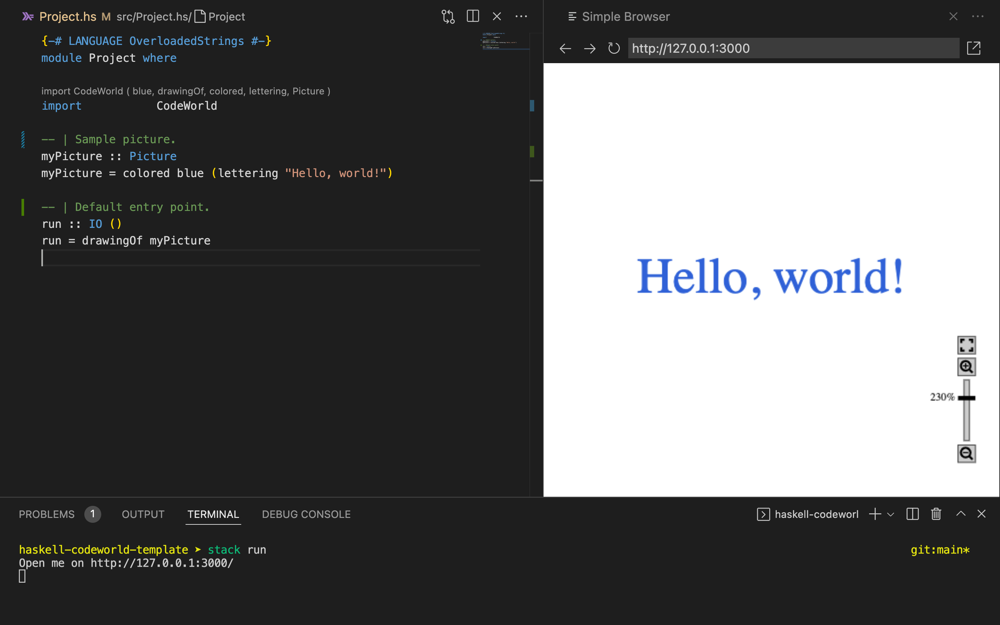

# Haskell project template with CodeWorld


This is a template project using `codeworld-api` package, ready to be used with either Cabal or Stack. The project also contains `hspec` (with automatic discovery of specification files) and `doctest` test suites.

## Prerequisites

This project can be build with Cabal and GHC 8.10.7 or with Stack tool.
We recommend that you use [ghcup](https://www.haskell.org/ghcup/) to install these.

There is IDE support for Cabal and Haskell through Haskell Language Server, in particular, there seems to be strong support for Haskell development in Visual Studio Code.
However, note that many of Haskell developers use Vim or Emacs with separate REPL (e.g. via `cabal v2-repl`) and [`ghcid`](https://github.com/ndmitchell/ghcid#readme).

## How to use

### Using Cabal

To build and run a project (without tests), use

```sh
cabal v2-run --disable-tests
```

from the project directory. This will download all the necessary dependencies, compile the project and start CodeWorld canvas server at http://localhost:3000

To simply build the project, run

```sh
cabal v2-build
```

To run tests:

```sh
cabal v2-test
```

#### Freezing dependencies

When you add/change dependencies of the project it is a good idea to freeze the used versions, to ensure the project will be successfully built on another machine at another time. To freeze dependencies, run

```sh
cabal v2-freeze
```

### Using Stack

To build and run a project (without tests), use

```sh
stack run
```

from the project directory. This will download all the necessary dependencies, compile the project and start CodeWorld canvas server at http://localhost:3000

To simply build the project, run

```sh
stack build
```

To run tests:

```sh
stack test
```

### With Visual Studio Code

One way to use VS Code is to open a browser tab, pointing to [http://localhost:3000](http://localhost:3000).


